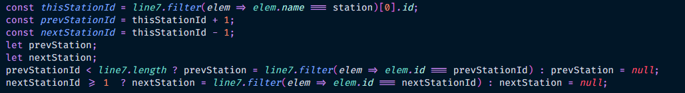
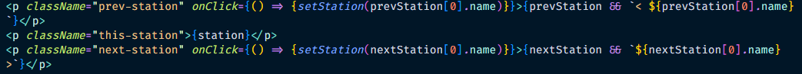

 

# 지하철 7호선 운행 안내 서비스
<a href="http://wbins2.dothome.co.kr/" title="새 창으로 열기" target="_blank">http://wbins2.dothome.co.kr/</a>
<blockquote>서울 열린데이터 광장 API를 이용하여 만든 지하철 7호선 운행 안내 서비스입니다</blockquote>
 

## 프로그래밍 언어 & 프레임워크

  
  
  
  

 

### API 호출 및 변수 정리

<blockquote>1) 서울 열린데이터 광장에서 발급받은 키를 이용하여 암호화(env 파일에 저장)한 뒤 API를 호출하였습니다.
 2) filter함수를 사용하여 7호선 노선만 가져오게 하였고, 상행과 하행을 구분하였습니다.
 3) arrivalMsg state에 객체로 값들을 담게 하였고, 값들이 없을 경우(종점에 가까운 역일수록 하행2 혹은 상행2값이 없을 경우)를 대비하여 '&&'을 사용하였습니다.</blockquote>
 

### Map 컴포넌트

<blockquote>7호선 데이터를 배열 안의 객체들로 담아준 뒤 js로 저장 후 export하였고, Map 컴포넌트 파일에서 import해준 다음 Station이라는 컴포넌트로 하나씩 뿌려지게 설정하였습니다.</blockquote>
 

### Station 컴포넌트

<blockquote>부모 컴포넌트인 Map에서 onClick={setStation}으로 station의 상태를 변화해주는 함수를 받아왔고, 클릭을 했을 때 station에 name값을 전달하게 하였습니다.
 또한 클릭이 발생했을 때 현재 클릭한 역을 알려주기 위해 현재 클릭한 역 name과 station에 설정된 state가 같을 경우 true를 반환하는 clickedStation을 만들어 class에 전달게 하였습니다.</blockquote>
 

### ArrInfo 컴포넌트

<blockquote>현재 역을 기준으로 이전 역과 다음 역의 정보를 받아오게 하였습니다.
 출발점이나 종점일 경우 각 이전역과 다음역이 없게 되므로 그에 따라 null이 반환되게 설정하였습니다.</blockquote>
 

<blockquote>이전 역과 다음 역을 클릭했을 때 station state의 값을 클릭한 역의 이름으로 바꾸는 함수를 작성하였습니다.</blockquote>
 

<blockquote>arrivalMsg state을 통해 받아온 값을 노출되게 하였고, 만약 값이 없을 경우 '도착 예정 정보가 없습니다'라는 텍스트가 노출되게 하였습니다.</blockquote>
 

## 프로젝트 설명
### 지하철역을 클릭하면 해당 역의 도착 정보를 확인 할 수 있어요

 

### 이전 역 혹은 다음 역을 클릭하면 이동됨과 동시에 이동된 역의 도착 정보가 노출돼요

 

### 새로고침 버튼을 누르면 최신 시간대의 도착 정보를 가져올 수 있어요

<blockqutoe>서울 열린데이터 광장에서 지원하는 API의 업데이트 시간이 30초라서 계속 새로고침해도 바로 반영되지는 않아요 :(</blockqutoe>
